# LibreNMS2Kafka2Prometheus

This project is to describe how to transport data exported by [LibreNMS](https://librenms.org) into [Prometheus](https://prometheus.io) through a [Kafka](https://kafka.apache.org/) Broker.

To achieve this, we use the data pipeline software, [Vector](https://vector.dev).

## Disclaimer

This is for now a Proof Of Concept (no resiliency is provied as of Now).

## Schema to illustrate

Nota Bene : Please don't overlook the icons, this is just to illustrate (no link with the iconified technologies)

Settings : I use 3 servers (VMs running Debian Linux 13) :

- One server for LibreNMS
- One server for Kafka and Vector
- One server for Prometheus (and Grafana not represented)

```mermaid
architecture-beta
    group gLibreNMS(logos:netuitive)[LibreNMS]
    service lnms(logos:aws-open-search)[LibreNMS]in gLibreNMS

    group gKafka(logos:kafka)[Kafka]
    service kafka(logos:aws-sns)[Kafka] in gKafka
    
    group vector(logos:vector)[Vector]
    service vKafkaSource(logos:aws-cloudtrail)[Kafka Source] in vector
    service vTransform(logos:aws-opsworks)[Transorm] in vector
    service vSink(logos:aws-kinesis)[Prometheus Exporter Sink] in vector
    
    group prometheus(logos:prometheus)[Prometheus]
    service scraping(logos:aws-appflow)[Prometheus Scaper] in prometheus
    service db(logos:aws-timestream)[Prometheus Database] in prometheus

    lnms:R --> L:kafka
    vKafkaSource:L --> R:kafka
    vKafkaSource:B --> T:vTransform
    vTransform:B --> T:vSink
    scraping:R --> L:vSink
    scraping:B --> T:db

```



So LibreNMS is pushing data into a Kafka Topic.

`Vector Kafka Source` is pulling data from this topic and passes all these to a bunch of `transform` and `routes` components of `Vector` to handle all the type of messages/events/metrics LibreNMS produces. These transforms also handle the modification/correction so thaht metrics can be read by `Prometheus Scraping` (Upercase metrics name or name with hyphen `-` are forbidden).
All these metrics are concentrated into a single `prometheus exporter sink`.

Then `Prometheus` scraping process will then get these metrics and store them.

## Technical implementations and configurations

### Basic LibreNMS configuration for Kafka

This is a basic configuration of LibreNMS to export Data into kafka topic

```json
{
    "enable": true,
    "debug": false,
    "security": {
        "debug": ""
    },
    "broker": {
        "list": "<YOUR BROKER HERE>"
    },
    "idempotence": false,
    "topic": "<YOUR TOPIC HERE>",
    "ssl": {
        "enable": false,
        "protocol": null,
        "ca": {
            "location": ""
        },
        "certificate": {
            "location": ""
        },
        "key": {
            "location": "",
            "password": ""
        },
        "keystore": {
            "location": "",
            "password": ""
        }
    },
    "flush": {
        "timeout": 1
    },
    "buffer": {
        "max": {
            "message": 100
        }
    },
    "batch": {
        "max": {
            "message": 10
        }
    },
    "linger": {
        "ms": 100
    },
    "request": {
        "required": {
            "acks": "0"
        }
    }
}
```

### Vector Configuration

Complete configuration of Vector :

https://github.com/htam-net/LibreNMS2Kafka2Prometheus/blob/665d45df8dac0959fb29aa84406ba62fda393cd9/vector-Kafka2Prometheus4LibreNMS.yaml#L1-L11

### Prometheus configuration

https://github.com/htam-net/LibreNMS2Kafka2Prometheus/blob/0ec4aa5f533f67ac4e42d5413f20ae71465f9fd3/prometheus.yaml